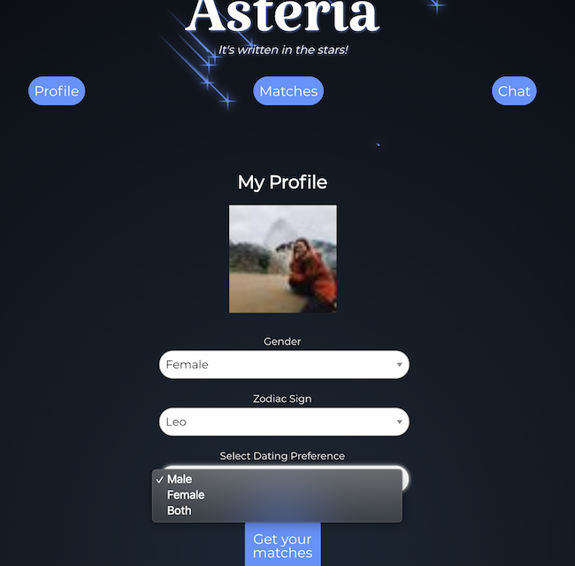

# Asteria

## Table of Contents
1. [Description](#description)
2. [Installation](#installation)
3. [Usage](#usage)
4. [Technologies](#technologies)
5. [License](#license)
6. [Contributors](#contributors)
7. [Credits](#credits)
8. [Tests](#tests)
9. [Questions](#Questions)

## Description
<a href ='https://asteria-app.herokuapp.com/'>Test Asteria Here</a>

Asteria is a full stack dating application that matches  users to other users based on zodiac signs. The user gets authorization to Asteria using Facebook, which creates the users Name and Profile picture. *(Facebook account is required)* Once the user gets access, they are refrenced to the profile page, where they input their sex, sexual preference, and most importantly their zodiac symbol. The main algorithm lies within the "Get your matches" button, which goes through the database and selects other users based on sexual preference and zodiac compatiability *i.e Libras are compatible with Gemini, Leo, Sagittarius, and Aquarius*. From there the user plays a swipe left or right game with their matches and will have the ability to chat. 





## Installation
To install the necessary dependencies, run the following commands:
```sh
npm i
```
```sh
npm start
```

Authorization 
```sh
Facebook Account Required
```
## Usage

## Technologies
  
  
 
 
 
  
## License

## Developers
* [Antonio Alvarado](https://github.com/antonio36alv)
* [Mo Civers-Davis](https://github.com/MoCivers-Davis)
* [Chris Lee](https://github.com/cil5345)
* [Casey Zacney](https://github.com/czacney)

## Credits

* [Tinderesque](https://christianheilmann.com/2015/09/06/tinderesque-building-a-tinder-like-interface-with-css-animations-and-vanilla-js-justcode/)
* [Codepen Shooting Stars by Yusuke Nakaya](https://codepen.io/YusukeNakaya/pen/XyOaBj)

## Tests
To run tests, run the following command:
```sh
npm run test
```

## Questions
If you have any questions or comments feel free to contact the developers.